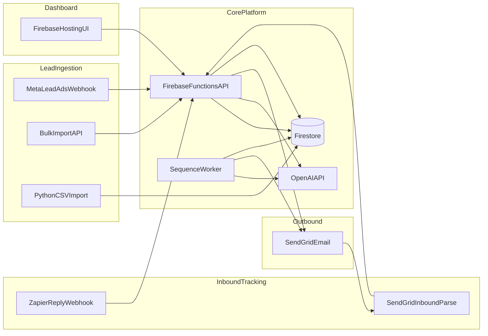

# Lead Automation Engine

AI-powered B2B lead automation platform built solo during a software engineering internship at OutreachPlatform. The system ingests leads, generates personalized outreach with OpenAI, delivers email through SendGrid, tracks replies, and runs scheduled follow-up sequences. All lead events are logged in Firestore under tenant-scoped paths.

The implementation is rather naive and I am sure it can be significiantly improved. Any contributions or suggestions are welcome :)

## Motivation

Manual cold outreach does not scale. Sales teams need a system that can accept leads from multiple sources, draft context-aware messages, send on a schedule, and stop when a prospect replies. This project automates that loop while keeping human review in the loop for inbound replies and AI-generated drafts.

## Architecture



See [docs/ARCHITECTURE.md](docs/ARCHITECTURE.md) for component details and Firestore layout.

## Tech stack

| Layer | Technology |
|---|---|
| API and workers | Node.js, Firebase Cloud Functions, Express |
| Database | Cloud Firestore (multi-tenant) |
| AI | OpenAI API |
| Email | SendGrid (outbound + inbound parse) |
| Automation | Zapier reply webhook integration |
| Dashboard | Firebase Hosting (static HTML/JS) |
| Data tooling | Python (export, import, reporting) |

## Features

- Multi-tenant Firestore data model (`tenants/{tenantId}/leads`, `targets`)
- Bulk lead and target import via REST API
- OpenAI-powered kickoff emails, follow-ups, icebreakers, and inbound reply drafts
- SendGrid email delivery with dry-run mode for safe testing
- SendGrid Inbound Parse endpoint for reply detection
- Zapier-friendly JSON webhook for reply events (`/api/webhooks/reply`)
- Scheduled sequence worker for automated follow-up emails
- Pipeline status tracking (need send, waiting on them, waiting on you, booked)
- Touch history and event logging on target documents
- Firebase Auth-protected operator dashboard
- In-app AI coach for workflow guidance
- Meta Lead Ads ingest adapter module (`ingest/meta/`, separate SMS path)
- Python scripts for CSV import, export, pipeline reporting, and webhook smoke tests

## Project structure

```
lead-automation-engine/
├── functions/           # Cloud Functions API, sequence worker, email provider
├── public/              # Firebase Hosting dashboard UI
├── ingest/meta/         # Meta Lead Ads webhook adapter
├── python/              # Data export, import, scoring, and reporting scripts
├── docs/                # Architecture and MVP notes
├── firebase.json        # Firebase project config
├── firestore.rules      # Firestore security rules
└── .env.example         # Environment variable template
```

## How it works

1. **Lead ingestion** - Contacts enter via bulk import API, CSV Python script, or the Meta adapter module. Each record is stored under `tenants/{tenantId}/`.
2. **AI composition** - When an operator starts outreach or a sequence step is due, OpenAI drafts a personalized email using company context, outreach vibe, and prior touch history.
3. **Email delivery** - SendGrid sends the message. Dry-run mode logs the payload without sending when `EMAIL_DRY_RUN` is enabled or no API key is set.
4. **Reply detection** - Inbound replies arrive through SendGrid Inbound Parse or a Zapier webhook POST. The API matches the sender to a target and cancels active follow-up sequences.
5. **Human review** - Inbound replies can land in a review queue. Operators approve or discard AI-suggested responses from the dashboard.
6. **Follow-up sequences** - A scheduled worker runs every minute, finds due targets, and sends the next sequence step or creates a draft for review.
7. **Logging** - Pipeline status, touch history, and webhook trace data are written to Firestore for audit and reporting.

## Setup

### Prerequisites

- Node.js 24+
- Python 3.11+
- Firebase CLI (`npm install -g firebase-tools`)
- A Firebase project with Firestore enabled
- OpenAI and SendGrid accounts

### Backend (Cloud Functions)

```bash
cd functions
npm install
```

Copy `.env.example` to `.env` at the repo root and fill in credentials. For local emulator work, export the same variables or use Firebase secrets in production.

```bash
firebase login
firebase use your-firebase-project-id
firebase deploy --only functions,hosting,firestore
```

### Python tooling

```bash
cd python
python -m venv .venv
.venv\Scripts\activate        # Windows
pip install -r requirements.txt
pytest tests/ -q
```

### Environment variables

All required keys are listed in [.env.example](.env.example). Never commit real secrets.

| Variable | Purpose |
|---|---|
| `OPENAI_API_KEY` | AI message generation |
| `SENDGRID_API_KEY` | Outbound email |
| `SENDGRID_FROM_EMAIL` | Verified sender address |
| `REPLY_WEBHOOK_SECRET` | Zapier reply webhook auth |
| `INBOUND_WEBHOOK_SECRET` | SendGrid inbound parse auth |
| `FIREBASE_PROJECT_ID` | Firestore access (Python scripts) |
| `META_WEBHOOK_VERIFY_TOKEN` | Meta adapter webhook verify |

## Future improvements

- Wire the Meta ingest adapter into the main Cloud Functions deployment
- LinkedIn conversation ingest adapter
- SendGrid event webhooks for open and click tracking
- Tenant admin UI for API key and sequence configuration
- Cloud Tasks queue for more reliable sequence scheduling at scale

## License

Private internship project. 
