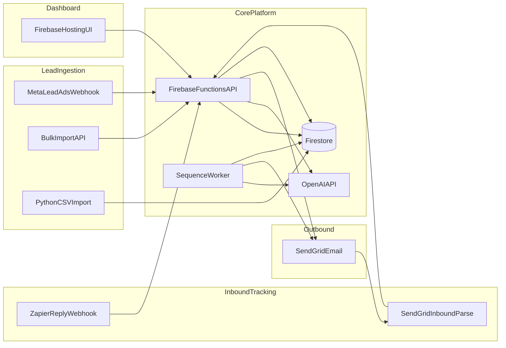

# Architecture

## System overview

Lead Automation Engine is a multi-tenant B2B outreach platform. Firebase Cloud Functions expose a REST API, Firestore stores tenant-scoped leads and targets, OpenAI drafts personalized messages, SendGrid delivers email, and a scheduled worker runs follow-up sequences. A Firebase Hosting dashboard lets operators review pipeline state and approve AI drafts.

## Data flow

## Firestore layout

Tenant-scoped paths keep data isolated:

- `tenants/{tenantId}/leads` - raw lead records from imports or ingest adapters
- `tenants/{tenantId}/targets` - outreach pipeline contacts with sequence state
- `tenants/{tenantId}/inboundReplies` - pending reply review queue
- Touch history and pipeline status live on target documents

## Components

| Component | Role |
|---|---|
| `functions/index.js` | Express API on Cloud Functions, scheduled sequence worker |
| `functions/apiRoutes.js` | REST routes, webhooks, AI compose endpoints |
| `functions/sequenceWorker.js` | Due follow-up processing every minute |
| `functions/emailProvider.js` | SendGrid send or dry-run |
| `ingest/meta/` | Meta Lead Ads webhook adapter (separate SMS path) |
| `public/` | Operator dashboard (leads, campaigns, email, coach) |
| `python/` | Data export, CSV import, pipeline reporting scripts |

## Inbound reply paths

1. **SendGrid Inbound Parse** - `POST /api/inbound/email-parse` receives multipart replies, matches sender to target, cancels active sequences.
2. **Zapier webhook** - `POST /api/webhooks/reply` accepts JSON from a Zap watching a shared inbox.

Both paths write to Firestore and can trigger in-app notifications.

## Security notes

- Firestore rules deny direct client access; the API uses Admin SDK.
- Webhook endpoints require shared secrets (`INBOUND_WEBHOOK_SECRET`, `REPLY_WEBHOOK_SECRET`).
- OpenAI and SendGrid keys are bound as Cloud Functions secrets in production.
